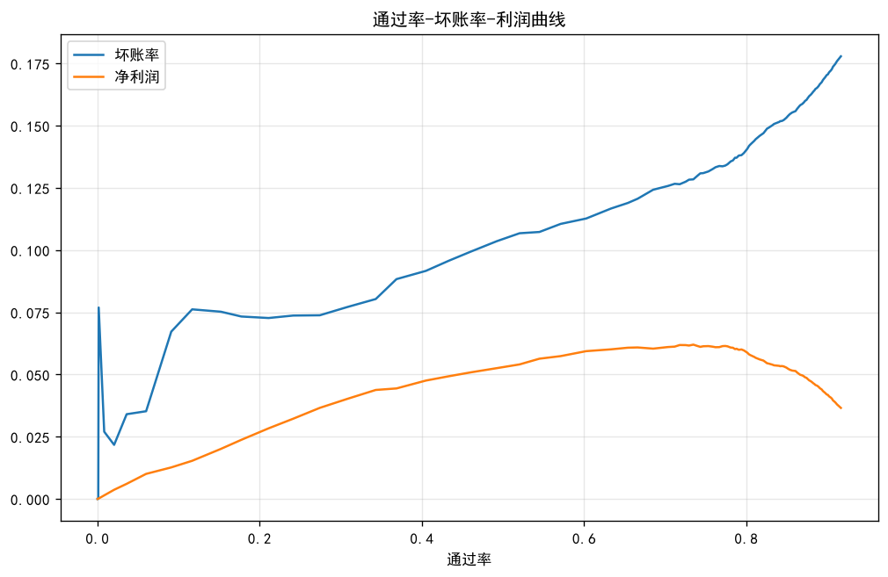
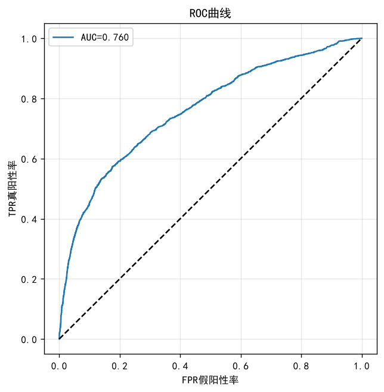
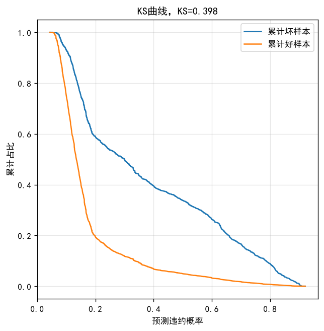
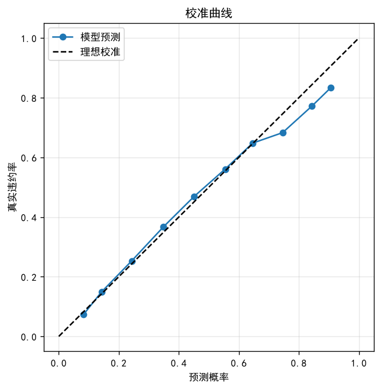
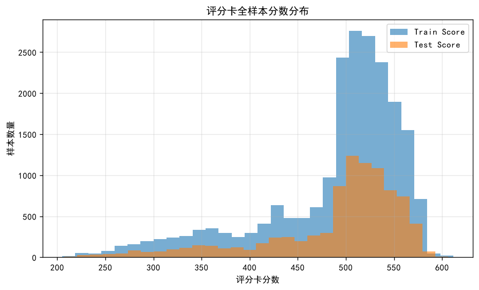

# 信用卡违约评分卡与风控策略设计

> 基于台湾信用卡违约数据集（UCI id=350，30000 条）的**全流程信贷风控项目**：
> 数据清洗 → 单变量 EDA → 分箱与 WOE/IV → 共线性诊断 → 逻辑回归评分卡
> → 刻度转换与分值表 → PSI 稳定性监控 → **策略设计与损益测算** → 模型对比。
>
> **核心结论**：该资产组合的盈亏平衡坏账率为 **22.22%**，而实际坏账率为 **22.12%**，
> 安全缓冲仅 **0.10 个百分点**。基于评分卡拒绝违约概率最高的客户后，通过率
> 100% → **73.46%**，坏账率 22.12% → **12.84%**，利润率 0.09% → **6.20%**。
> 而**单条规则「最近一期有逾期」即可拿到约 91% 的收益**（通过率 77.70%、坏账率 14.14%、利润率 5.65%）。



---

## 目录

- [一、业务问题](#一业务问题)
- [二、数据说明](#二数据说明)
- [三、方法流程](#三方法流程)
- [四、核心结果](#四核心结果)
- [五、关键发现](#五关键发现)
- [六、局限与反思](#六局限与反思)
- [七、如何运行](#七如何运行)
- [八、项目结构](#八项目结构)
- [九、技术栈](#九技术栈)
- [十、修订记录](#十修订记录)
- [附：可复用的核心公式](#附可复用的核心公式)

---

## 一、业务问题

信用卡业务要在**通过率**和**坏账率**之间做取舍：放款太松，坏账升高、亏钱；放款太紧，
损失优质客户的利息收入、也亏钱。

所以真正要回答的不是「预测谁会违约」，而是：

> **拒掉多少客户、拒掉哪些客户，才能让利润最大。**

本项目要交付的也不只是一个模型，而是**一份能落地的准入策略 + 一张可以直接手工复算的分值表**。

---

## 二、数据说明

| 项 | 说明 |
|---|---|
| 来源 | UCI Machine Learning Repository, id=350（Default of Credit Card Clients） |
| 规模 | **30000 行 × 25 列** |
| 标签 | `default payment next month`（下月是否违约） |
| 坏账率 | **22.12%**（6636 / 30000） |
| 缺失值 | **0** |
| 时间字段 | **无**（只有 1~30000 的顺序 ID） |

### 数据清洗要点

| 处理 | 数量 | 做法与理由 |
|---|---|---|
| EDUCATION 未定义编码 | 0/5/6 共 **345 条** | 归入 4（其他）。文档只定义 1/2/3/4，未定义值单独成箱会变噪声箱 |
| MARRIAGE 未定义编码 | 0 共 **54 条** | 归入 3（其他），同上 |
| 溢缴款识别 | BILL_AMT1 负值 **590 笔** | 客户还多了钱，是**正常客群特征**而非脏数据，单独标记不删除 |
| 还款额全为 0 的客户 | **1432 人（4.77%）** | 单独观察，这类客户的风险特征与普通客户不同 |
| 表头 | **在第 2 行** | 第一行是 X1..X23，必须 `pd.read_excel(path, header=1)` |
| `PAY_0` | 重命名为 `PAY_1` | 与 `PAY_2..PAY_6` 命名对齐 |

**多数类基线准确率 = 77.88%** —— 模型的准确率不超过它就没有价值，所以本项目全程用
**KS / AUC** 这类排序指标评估，而不是准确率。

---

## 三、方法流程

```
步骤0  数据加载与清洗
步骤1  单变量 EDA 与坏账率分析
步骤2  分箱与单调性（卡方/等频 + 粗分类合并）
步骤3  WOE / IV 计算与变量筛选
步骤4  共线性诊断（相关系数 + VIF）
步骤5  WOE 编码建模与评估（KS / AUC / 交叉验证）
步骤6  statsmodels 系数表与显著性 → 决定剔除哪些变量 → 重新拟合主交付模型
       （主交付模型确定后，绘制 ROC / KS / 校准三张图）
步骤7  评分卡刻度转换（A / B / 基础分 / 分值表 / 复核）
步骤8  PSI 稳定性监控（随机切分 vs 按 ID 排序的伪 OOT）
步骤9  策略设计与损益测算（通过率-坏账率-利润曲线 + 硬规则 + LGD 敏感性）
步骤10 模型对比与结论（两种特征口径各训一遍）
末    自动生成 outputs/summary.txt（关键结果汇总）
```

### 关键方法说明

| 环节 | 做法 |
|---|---|
| 分箱 | 连续变量用等频分箱打底，再按**单调性**做粗分类合并；离散变量按业务含义归并 |
| WOE 约定 | **WOE = ln(坏样本占比 / 好样本占比)**，WOE 越大风险越高，因此回归系数应为正 |
| IV | `IV = Σ(坏占比 − 好占比) × WOE`，本质是 Jeffreys 散度，恒 ≥ 0 |
| 箱数 | 每箱样本量不低于总体的 5%，最终落在 5~8 箱；箱数权衡见代码步骤2 注释 |
| 变量筛选 | **IV 负责海选（单变量区分度），逻辑回归负责终选（多变量显著性 + 业务可解释）** |
| 主模型 | 逻辑回归（可解释、可审计、可转成 Excel 分值表），不用树模型做主决策 |
| KS 计算 | **先按分数值聚合成组，再累计 CDF**；逐行累计在大量同分时会产生虚假间距（见修订记录） |

---

## 四、核心结果

### 4.1 数据与清洗

```
数据形状: (30000, 25)    缺失值总数: 0
整体坏账率: 22.12%（6636/30000）
多数类基线准确率: 77.88%
六个月还款额全为 0 的客户数: 1432（占比 4.77%）
BILL_AMT1 负值（溢缴款）笔数: 590
```

**ID 分段时间代理检验**：卡方 = **33.9338**，p < 0.001，自由度 4。
但各段坏账率**极差只有 0.0395 且无单调趋势** —— 判定为大样本下的统计显著而非真实时间漂移，
**因此不采用 ID 作为时间代理**。

### 4.2 变量区分度（IV 排序）

| 变量 | IV | 处理 |
|---|---|---|
| **PAY1_bin** | **0.8610** | 保留 |
| delay_cnt_bins | 0.6695 | 排除（由 PAY_* 计算而来，信息重复） |
| PAY2_bin | 0.5445 | 保留 |
| PAY3_bin | 0.4107 | 保留 |
| PAY4_bin | 0.3585 | 保留 |
| PAY5_bin | 0.3322 | 保留 |
| PAY6_bin | 0.2883 | 保留 |
| limit_bin_final | 0.1772 | 保留 |
| pay1_bins | 0.1546 | 保留 |
| pay2_bins | 0.1393 | 保留 |
| pay_ratio1_bins | 0.1290 | **已剔除**（系数符号翻转，见[局限 6](#6-pay_ratio1_bins-系数符号翻转已从交付版剔除)） |
| pay3_bins | 0.1166 | 保留 |
| pay4_bins | 0.0821 | 保留 |
| pay6_bins | 0.0804 | 保留 |
| pay5_bins | 0.0687 | 保留 |
| util_bins | 0.0499 | 保留 |
| EDUCATION | 0.0368 | 保留 |
| age_bins | 0.0206 | **已剔除**（非单调 + 不显著，见[局限 4](#4-age_bins-非单调且不显著已剔除)） |
| **BILL_AMT1~6 合计** | **0.0662**（每个均 <0.02） | **全部剔除** |
| SEX | 0.0092 | 剔除 |
| MARRIAGE | 0.0055 | 剔除 |

> **IV 阈值参考**：<0.02 几乎无预测力；0.02~0.1 弱；0.1~0.3 中等；0.3~0.5 强；**>0.5 需警惕**
> （可能标签泄漏、过拟合或业务不可持续）。
> 本数据 `PAY1_bin` 的 IV = 0.8610 远超警戒线，逐项排查后确认不是泄漏
> —— 它是「最近一期还款状态」，申请时即可获得，业务上完全合理。

### 4.3 分箱后各箱坏账率（单调性已验证）

**`PAY1_bin`（最近一期还款状态）—— 单调递增**：正常(≤0) → 逾期1个月 → 逾期2个月 →
逾期3个月以上，坏账率依次上升，各箱最大差异 = **0.0490**。

**`limit_bin_final`（授信额度）—— 单调递减**：额度越低坏账率越高，符合业务预期。

### 4.4 共线性诊断

- 六个 `BILL_AMT` 变量之间存在 **16 组 |r| > 0.7** 的强相关，最高为
  `BILL_AMT1 ~ BILL_AMT2 = 0.9515`
- 按 IV 剔除 `BILL_AMT*` 后，**入模变量最大 VIF = 3.4237**（经验阈值：>5 需关注，>10 严重）
- 结论：**变量筛选一步解决了两个问题** —— 既去掉了无预测力的变量，也消除了严重共线性

### 4.5 模型表现

**本项目交付两个版本，主交付为精简版：**

| 版本 | 变量数 | 测试集 AUC | 测试集 KS |
|---|---|---|---|
| 对照：全变量 | 17 | 0.7605 | 0.3995 |
| **主交付：剔除 7 个变量** | **10** | **0.7597** | **0.3975** |

剔除的 7 个变量：`age_bins`、`PAY2_bin`、`PAY4_bin`、`pay4_bins`、`pay5_bins`、`pay6_bins`
（以上 6 个为 p>0.05 不显著）+ `pay_ratio1_bins`（系数符号翻转，见局限 6）。

**主交付模型（10 变量）完整指标：**

| 指标 | 数值 |
|---|---|
| 训练集 AUC / KS | 0.7695 / 0.4105 |
| 测试集 AUC / KS | **0.7597 / 0.3975** |
| 训练−测试 差值 | AUC 0.0098 / KS 0.0130（差值 <0.02，无明显过拟合） |
| 5 折交叉验证 AUC | **0.7689 ± 0.0107** |
| 伪 R²（McFadden） | 0.1762 |
| AIC / BIC | 18305.6 / 18393.1 |

> **为什么主交付用 10 变量而不是 17 变量**：被剔除的变量要么统计上不显著、要么系数符号
> 与业务逻辑相反，风控评分卡的原则是**每个入模变量都必须统计显著且业务可解释**。
> 全变量版本保留在报告中作为对照证据（它同时也是"共线性导致符号翻转"的实测案例）。







**关于校准**：KS / AUC 只衡量排序能力，不保证概率准确。校准曲线检查的是「模型说的
20% 违约率是否真的是 20%」—— 因为后续要用这个概率**算钱**，所以排序指标和校准指标必须都看。

### 4.6 系数显著性（statsmodels）

**6 个不显著变量（p > 0.05）：**

| 变量 | 系数 | p 值 |
|---|---|---|
| age_bins | 0.2309 | 0.0975 |
| PAY2_bin | 0.0417 | 0.3013 |
| PAY4_bin | 0.0960 | 0.0706 |
| pay4_bins | 0.1594 | 0.0928 |
| pay5_bins | 0.0026 | 0.9784 |
| pay6_bins | 0.1698 | 0.0523 |

**全部 17 个入模变量中，16 个系数为正、1 个为负。**
唯一负系数是 `pay_ratio1_bins = −0.2024`（p = 0.0150，统计显著但符号与业务逻辑相反）。
它虽然显著，但**已从主交付模型中剔除**，理由见[局限 6](#6-pay_ratio1_bins-系数符号翻转已从交付版剔除)。

### 4.7 评分卡

**刻度参数：**

```
base_score = 600     基准分
base_odds  = 20      基准 odds（好/坏）
PDO        = 50      odds 翻一倍所需的分数

B = PDO / ln(2)                        = 72.1348
A = base_score − B · ln(base_odds)     = 383.9036
基础分 = A − B · β₀                     = 473.90
```

**分数分布：**

| 集合 | 最小值 | 中位数 | 最大值 |
|---|---|---|---|
| 训练集 | 205.19 | 511.13 | 611.65 |
| 测试集 | 207.28 | 511.02 | 606.31 |

两组分布几乎重合，说明模型在训练/测试上行为一致。



**分值表自检：**

```
方向自检：prob_to_score(1/21) = 600.0000（应等于 base_score=600）
高风险用户(p=0.3)分数       = 445.02
低风险用户(p=0.0476)分数    = 600.03
分值表复核：与公式算出的分数最大误差 = 0.000000（应为 0）
```

**部分分值表（`outputs/score_card.csv` 为完整版，共 45 行）：**

| 变量 | 分箱 | WOE | β 系数 | bin_score |
|---|---|---|---|---|
| **PAY1_bin** | 正常(≤0) | −0.5819 | 0.7524 | **−31.58** |
| **PAY1_bin** | 逾期1个月 | 0.6048 | 0.7524 | **+32.83** |
| **PAY1_bin** | 逾期2个月 | 2.0796 | 0.7524 | **+112.87** |
| **PAY1_bin** | 逾期3个月以上 | 2.1835 | 0.7524 | **+118.51** |
| EDUCATION | 1（研究生） | −0.1608 | 0.3540 | −4.11 |
| EDUCATION | 2（大学） | 0.0834 | 0.3540 | +2.13 |
| EDUCATION | 3（高中） | 0.1649 | 0.3540 | +4.21 |
| EDUCATION | 4（其他） | −1.2645 | 0.3540 | **−32.29** |

**客户得分 = 基础分 − Σ 各变量 bin_score**，其中 `bin_score = WOE × β × B`。

**方向检查（记分规则是"减 bin_score"，所以 bin_score 为正 = 扣分）**：

- `PAY1_bin`：正常 → bin_score 为负 → **加分**；逾期越久 → bin_score 越大 → **扣分越多**。符合业务。
- `EDUCATION=4`：bin_score = −32.29 → **加分 32.29 分**。该档只有 468 人，稳定性存疑，见[局限 5](#5-education4-小样本箱保留并纳入监控)。

> **分值表复核误差为 0** 是本项目的一个硬性验收项：业务方要在 Excel 里手工算分、
> 做人工复核和离线批量跑分，**分值表必须和模型完全一致**。

### 4.8 PSI 稳定性监控

| 场景 | 最大 PSI | 判定 |
|---|---|---|
| 训练集 vs 随机切分测试集 | **0.000819** | 数学必然 ≈0，**不构成稳定性证据** |
| **按 ID 排序的伪 OOT** | **0.06948**（pay3_bins） | 稳定（其余全部 <0.015） |

| 伪 OOT 对比 | 坏账率 |
|---|---|
| 前 70%（早期样本） | **22.84%** |
| 后 30%（后期样本） | **20.44%** |

> **关于「随机切分 PSI≈0」这个陷阱**：把同一时间段的样本随机拆成训练/测试，
> 两组来自同一总体、同一客群，每个分箱的占比本来就该几乎一样，PSI 自然趋近 0。
> **这不是模型稳定，这只是「我用随机数分了个组」。**
> 真正的稳定性监控必须看时间维度（本月 vs 上月、新客 vs 建模样本）。
> 本数据集没有日期字段，所以只能用按 ID 排序的伪 OOT 做近似，并且要明确它只是弱证据。

### 4.9 策略与损益测算

**损益参数（假设值，非实测）：**

```
NIM（净息差）= 20%      LGD（违约损失率）= 70%

盈亏平衡坏账率 = NIM / (NIM + LGD) = 0.20 / 0.90 = 22.22%
实际整体坏账率 = 22.12%
安全缓冲 = 0.10 个百分点
```

> 本数据集**没有资金成本和催收回收数据**，这两个参数是假设值。
> `LGD` 升到 0.80 时盈亏平衡坏账率降到 20.00%，**低于实际坏账率 22.12%，组合转为亏损**
> —— 结论对该假设高度敏感，见下方 LGD 敏感性分析。

**通过率 — 坏账率 — 利润曲线（测试集 9000 条）：**

| 策略点 | 通过率 | 坏账率 | 利润率 |
|---|---|---|---|
| **无策略（全部通过）** | 100.00% | 0.2212 | **0.0900%** |
| cutoff = 0.100 | 21.09% | 0.0727 | 2.84% |
| cutoff = 0.125 | 36.86% | 0.0883 | 4.44% |
| cutoff = 0.150 | 52.03% | 0.1068 | 5.41% |
| cutoff = 0.165 | 60.24% | 0.1127 | 5.94% |
| **cutoff = 0.215（最优）** | **73.46%** | **0.1284** | **6.2011%** |
| cutoff = 0.250 | 76.66% | 0.1338 | 6.10% |
| cutoff = 0.300 | 79.69% | 0.1390 | 5.97% |
| cutoff = 0.400 | 86.06% | 0.1558 | 5.14% |
| cutoff = 0.500 | 88.71% | 0.1652 | 4.55% |
| cutoff = 0.600 | 91.64% | 0.1779 | 3.66% |

**两个必须说清的点：**

> **① 最优阈值有解析解。** 本项目的损益是线性的：接受一个客户赚 `(1−p)·NIM`，
> 违约则亏 `p·LGD`。所以 accept 条件 `(1−p)·NIM > p·LGD` 即 `p < NIM/(NIM+LGD) = 0.2222`。
> **这是期望意义下的闭式最优**；上表网格给出的是**本测试集上的实际最优点**（含抽样波动），
> 两者相差 0.007 属于正常范围。网格仅用于画曲线和定位最优点。

> **② 「最优」不等于「坏账率最低」。** 全部拒绝时坏账率为 0，但也没有业务；
> 全部通过时收入最大，但坏账率 22.12% 已接近盈亏平衡点，利润率只剩 0.0900%。
> 最优点是**边际收益等于边际损失**的位置。

**代价必须说清**：最优策略下拒绝了违约概率最高的 **26.54%**（2389 人）客户，
换来坏账率下降 9.28pp、利润率提升 6.11pp。代价有两项：

- **放弃 26.54% 的放款规模**；
- **误杀**：被拒的 2389 人里坏客户只有 1142 人（**被拒人群坏账率 47.80%**），
  也就是 **52.20% 的被拒者其实是好客户** —— 他们的利息收入被放弃了。

> **这两个数极易混，务必分清：**
>
> | 口径 | 数值 | 含义 |
> |---|---|---|
> | 通过人群坏账率 | 12.84% | 放进来的人里坏客户占 12.84%（好客户占 87.16%） |
> | **被拒人群坏账率** | **47.80%** | 拒掉的人里坏客户占 47.80% |
> | **被拒人群误杀率** | **52.20%** | 拒掉的人里好客户占 52.20% |
>
> **「87.16%」是通过人群的好客户占比（= 1 − 12.84%），不是被拒人群的误杀率。**
> 误杀率必须用「总体坏账 − 通过人群贡献的坏账」反推，不能拿通过人群的坏账率去减 1。
> 本 README 早期版本在这里写错过（把 87.16% 当成了误杀率），现已修正，
> 并且这段数字改由脚本自动算出（见 `outputs/summary.txt` 的"被拒人群误杀率"）。

**硬规则策略（测试集）：**

| 规则 | 命中率 | 命中坏账率 | 拒绝后通过率 | 拒绝后坏账率 | 拒绝后利润率 |
|---|---|---|---|---|---|
| **规则1：最近一期有逾期** | 22.30% | **49.93%** | **77.70%** | **14.14%** | **5.65%** |
| 规则2：最近一期逾期2个月 | 8.67% | **68.33%** | 91.33% | 17.74% | 3.69% |
| 规则3：额度使用率 > 0.8 | 26.83% | 26.21% | 73.17% | 20.62% | 1.05% |
| 规则4：有逾期 且 使用率 > 0.8 | 7.50% | 52.59% | 92.50% | 19.65% | 2.14% |
| 规则5：授信额度 ≤ 3万 | 13.52% | 33.36% | 86.48% | 20.36% | 1.45% |

> **规则1 一条就拿到评分卡约 91% 的收益**（5.65% / 6.2011%），而且通过率还更高。
> 注意评估规则质量的关键指标是**命中坏账率**（49.93%）而不是命中率。

**LGD 敏感性分析（细网格，步长 0.005）：**

| LGD | 盈亏平衡坏账率 | 最优 cutoff | 最优利润 |
|---|---|---|---|
| 0.50 | 28.57% | 0.265 | 740.0 |
| 0.60 | 25.00% | 0.260 | 646.6 |
| **0.70** | **22.22%** | **0.215** | 558.1 |
| 0.80 | **20.00%** | 0.175 | 477.0 |

> **趋势解读**：LGD 上升 → 盈亏平衡坏账率下降 → 最优 cutoff 同步**下调**、准入**收紧**
> （因为 accept 条件是 `prob < cutoff`，门槛降低意味着通过的人更少）。
> **LGD = 0.80 时盈亏平衡坏账率 20.00% 已低于实际坏账率 22.12%，此资产组合转为亏损。**
>
> 说明：原实现用 `np.linspace(0, 0.6, 30)`（步长 0.0207），分辨率不足以体现这一变化，
> 导致 LGD=0.6/0.7/0.8 三档都落到同一个网格点上、看不出趋势。现已改为细网格。

### 4.10 模型对比（同一训练/测试集，两种特征口径各训一遍）

| 模型 | WOE 特征 AUC | WOE 特征 KS | 原始特征 AUC | 原始特征 KS |
|---|---|---|---|---|
| 基线（训练集均值） | 0.5000 | **0.0000** | 0.5000 | 0.0000 |
| **逻辑回归评分卡（主交付）** | **0.7597** | **0.3972** | 0.7150 | 0.3757 |
| 决策树(d=4) | 0.7403 | 0.3828 | 0.7366 | 0.3968 |
| 随机森林(300棵) | 0.7157 | **0.3238** | 0.7605 | **0.4056** |
| 梯度提升 | 0.7702 | 0.4029 | **0.7801** | **0.4355** |

> 注：本表"逻辑回归评分卡"一行由 `sklearn.LogisticRegression`（L2 正则，`C=1.0`）训练，
> KS = 0.3972；而交付评分卡实际使用的是 `statsmodels.Logit`（无正则 MLE），KS = 0.3975。
> 两者变量集完全相同，**0.0003 的差异来自正则化**，可忽略。本 README 其它位置引用的是
> 交付版本（statsmodels）的 0.3975。

> **这个对比必须按同一口径看，否则会得出错误结论。**
>
> WOE 分箱是为了让逻辑回归拿到「分组线性化 + 单调」的输入，代价是丢掉原始取值细节；
> 而树模型本来就能自己搜切分点，喂它分箱后的有序整数等于替它做了一次很粗的切分，**是净损失**。
>
> **证据**：随机森林在 WOE 特征下 KS 只有 0.3238，**竟然低于单棵限深决策树的 0.3828**
> —— 正常情况不该发生。改用原始特征后 KS 升到 **0.4056**，恢复正常的模型排序。
>
> **公平口径下的真实结论**：梯度提升（原始特征）KS = **0.4355**，
> 比评分卡（WOE 特征）的 0.3972 高 **0.0383** —— 这不是「差距小到可以忽略」，
> 而是**用可解释性和稳定性主动换掉了一部分区分度**。
> 评分卡的优势在：每个变量有系数 / OR / p 值，能回答「为什么拒绝这个客户」；
> 监管要求可解释可申诉；PSI 易控；分值表 Excel 就能复算。
> （说明：逻辑回归在原始特征上必须先标准化，否则量纲差 3 个数量级会导致 lbfgs 不收敛。）

### 4.11 上线后监控方案

| 监控维度 | 指标 | 预警阈值 | 触发动作 |
|---|---|---|---|
| 模型稳定性 | 分数 PSI（按月） | >0.1 关注，>0.25 报警 | 排查客群变化；>0.25 启动重训 |
| 变量稳定性 | 各变量 PSI | >0.1 | 检查该变量数据源与口径 |
| 规则监控 | 各规则命中率 | 单条规则波动 >30% | 排查规则是否被绕过 |
| **单箱监控** | **`EDUCATION=4` 的样本占比与坏账率** | 占比或坏账率明显变化 | 立即做粗分类合并或剔除该档 |

**上线路径**：离线验证 → 5% 流量灰度（观察 1~2 个账期，实际坏账率与预测偏差 <20%）
→ 冠军挑战者（新旧策略各 10% 流量对比）→ 逐步放量至 100%。

---

## 五、关键发现

### ① 该资产组合处在盈亏平衡线附近，风控是「生死开关」而非「优化项」

盈亏平衡坏账率 **22.22%** vs 实际 **22.12%**，缓冲只有 **0.10 个百分点**。
在这个位置，坏账率的微小变化就是盈利与亏损的区别。

> 注意：README 早期版本写过「利润率从 0.09% 提升到 6.24%，约 **69 倍**」。
> **这个倍数是盈亏平衡点附近的数学放大效应**（利润 = 两个大数相减的小差），
> 不是业务凭空多赚了 69 倍，**不能写进简历**。正确的表述是
> **「利润率提升 6.11 个百分点」**。

### ② 单条规则就能拿到评分卡约九成的收益

| 策略 | 通过率 | 坏账率 | 利润率 |
|---|---|---|---|
| 评分卡最优（cutoff=0.215） | 73.46% | 12.84% | **6.2011%** |
| **单规则：最近一期有逾期** | **77.70%** | 14.14% | **5.65%** |

**这解释了风控策略岗的真实工作状态**：真实业务中大量策略是「简单规则 + 名单」，
因为规则**可解释、可审计、上线快、出事好定位**；评分卡更适合缺少单一强变量、
需要精细排序或定额度的场景。行业常规是**组合方案：硬规则前置拦截极端风险，评分卡做主准入**。

### ③ 「欠多少钱」几乎没有预测力，「还得怎么样」才是关键

`BILL_AMT1~BILL_AMT6` 六个账单金额变量的 **IV 合计只有 0.0662**，每一个都 <0.02；
而还款状态（`PAY_*`）和还款金额（`PAY_AMT*`）的 IV 高达 0.07~0.86。

**业务解释**：账单金额高低反映的是消费能力/授信额度水平，**不反映还款意愿**。
一个额度 30 万、欠 20 万但每月按时还款的客户，风险远低于额度 1 万、欠 5000 但逾期的客户。

### ④ 单变量 IV 高 ≠ 多变量有用

`PAY2_bin` 单变量 IV = **0.5445**（全变量第 3 高），但进入多变量逻辑回归后
**p = 0.3013，完全不显著**。原因：它与 `PAY1_bin` 相关系数 r = 0.672，
「最近一期还款状态」已经吸收了它的大部分信息。

> **IV 负责「海选」，逻辑回归负责「终选」。IV 高只是入场券，不代表能留在模型里。**

### ⑤ 共线性会让系数「显著但符号错误」——本项目实测到了一例，并已处理

`pay_ratio1_bins` 的系数是 **−0.2024，p = 0.0150（统计上显著）**，但符号与业务逻辑相反：
还款比例越高应当风险越低，系数却为负。

**成因**：它的分子 `PAY_AMT1` 与 `pay1_bins` 重复，分母 `BILL_AMT1` 已通过 `util_bins` 入模
—— 三个变量都在描述「还款能力」，信息重叠导致系数被扭曲。

**后果（这是必须处理的原因）**：在全变量对照版本里，把它的 WOE 和系数相乘就能看出方向被扭反了 ——
WOE 为**正**的「完全不还款」档得到**负**的 bin_score（即给客户**加分**），
WOE 为**负**的「大额/全额还款」档得到**正**的 bin_score（即**扣分**）。
而记分规则是 `客户得分 = 基础分 − Σ bin_score`，所以**方向完全反了**：
还得越多、扣分越多。这一项在两个极端档之间造成的分数摆动有十余分，业务方一定会问
「为什么还得多反而扣分」。

**处理**：**已从主交付模型中剔除**，全变量版本保留它作为共线性案例。

### ⑥ 时间稳定性无法验证，且随机切分的 PSI 是个陷阱

见 [4.8](#48-psi-稳定性监控)。数据集**没有日期字段**，只有 1~30000 的顺序 ID。
ID 分段卡方检验 p<0.001 显著，但各段极差只有 **0.0395** 且无单调趋势
—— 判定为**大样本下的统计显著，而非真实时间漂移**，因此不采用 ID 作为时间代理。

- **随机切分的 PSI ≈ 0.000819** 是数学必然，**不能当作稳定性证据**
- 只有**按 ID 排序的伪 OOT**（最大 PSI = 0.06948）才有一点参考价值，它揭示
  早期样本坏账率 22.84% 高于后期 20.44%

---

## 六、局限与反思

### 1. 无法进行真正的时间外（OOT）验证

数据无日期字段。所有验证都是**分层随机切分**，因此模型的**时间稳定性未经验证**。
真实业务中客群结构、宏观环境、竞品策略都会随时间变化，模型可能在 6~12 个月后失效。
**本项目的 KS = 0.3975 不能保证在未来样本上成立。**

### 2. 样本选择偏差（reject inference）

本数据全部是**已发卡客户**（即已经通过了当年审批的样本），**不含拒绝样本**。
而策略上线时面对的是**全部申请者**。
**因此本项目的策略效果不能直接外推到全量申请人群。**

### 3. 损益测算依赖假设参数

`NIM=20%`、`LGD=70%` 均为**假设值**，数据集中没有资金成本、催收回收数据。
实测 LGD 升到 0.80 时，盈亏平衡坏账率（20.00%）就低于实际坏账率（22.12%），
资产组合转为亏损 —— **结论对该假设高度敏感**。

### 4. `age_bins` 非单调且不显著（已剔除）

原始 10 箱等频分箱，WOE 呈锯齿状（U 型 + 噪声），且 p=0.0975 不显著、IV=0.0206 刚刚压线。
**三条都不合格**，已按 p 值筛掉，主交付的 10 变量模型中不再包含它。

### 5. `EDUCATION=4` 小样本箱（保留并纳入监控）

只有 **468 人（1.56%）**、坏账率仅 **7.05%**，WOE = **−1.26**，导致该档客户总分被推高
**32.29 分**。很可能是特殊客群（如学生卡、VIP 卡）混入。

**为什么保留而不是直接剔除**：
- 该信号在数据上是**真实的**（这 468 人确实坏账率极低），不是噪声；
- 直接剔除整条 `EDUCATION` 会丢掉这个显著变量（p<0.001）的信息；
- 把它并入相邻档会造成语义混乱（「其他」并入「大学」在业务上说不通）。

**这是一个"已知的、有意识的取舍"，处理方式是纳入上线监控**：如果该档样本占比或坏账率
发生明显变化，立即做粗分类合并或剔除。已写入 4.11 的监控表。

### 6. `pay_ratio1_bins` 系数符号翻转（已从交付版剔除）

`pay_ratio1_bins` 是唯一的负系数（−0.2024，p=0.0150），成因是与
`pay1_bins`/`util_bins` 的信息重叠。**已从主交付模型剔除**，只在
"全变量对照版本"中保留，作为共线性导致符号翻转的实测证据。

### 7. 如果给我真实数据，我会这样做

1. 按**放款月份**切分做真正的 OOT（训练早期、验证后期）
2. 按**月**计算分数 PSI 做漂移监控，设置 0.1/0.25 双阈值告警
3. 用**冠军挑战者**框架小流量验证策略，观察 1~2 个账期
4. 补充**拒绝推断**或在小流量上做 A/B 实验，校正样本选择偏差
5. 用真实催收数据估计 LGD，替换假设值
6. 补**策略矩阵**（硬规则前置拒绝 → 剩余人群上评分卡 cutoff）与**交换矩阵（swap set）**分析

---

## 七、如何运行

### 环境依赖

```bash
pip install -r requirements.txt
```

> 或手动安装：
> ```bash
> pip install pandas numpy matplotlib statsmodels scikit-learn scipy openpyxl xlrd
> ```
> Python 3.13 / pandas 3.0.3 / numpy 2.5.1 / scikit-learn 1.9.0 / statsmodels 0.14.6 下测试通过。
> 读取 `.xls` 需要 `xlrd`。

### 数据准备

从 [UCI 数据集页面](https://archive.ics.uci.edu/dataset/350/default+of+credit+card+clients)
下载 `default of credit card clients.xls`。

**脚本会按以下顺序自动查找数据文件**（用第一个存在的）：

| 顺序 | 位置 | 说明 |
|---|---|---|
| ① | 脚本同级目录 | **推荐**：把 `.xls` 和 `credit-scorecard.py` 放在一起即可 |
| ② | 脚本同级 `data/` 子目录 | 想把数据单独放一个文件夹时用 |
| ③ | `CANDIDATE_PATHS` 里的其他路径 | 数据放在别处时，把路径加进这个列表 |

正常情况下**不需要改任何代码**。三个位置都找不到时，脚本会抛出明确提示：

```
FileNotFoundError: 找不到数据文件：default of credit card clients.xls
请从 https://archive.ics.uci.edu/dataset/350 下载 "default of credit card clients.xls"，
放到脚本同级目录（或 data/ 子目录）即可；
也可以修改脚本顶部的 CANDIDATE_PATHS 指向你的实际路径。
```

> 该文件**前两行都是表头**（第一行是 X1..X23，第二行才是真实列名），
> 所以读取必须用 `pd.read_excel(path, header=1)`。
> 数据集本身**未包含在仓库中**（`.gitignore` 已忽略 `*.xls`），需自行下载。

### 运行

```bash
python credit-scorecard.py
```

脚本会自动在**脚本所在目录**创建 `outputs/` 文件夹，把所有产物落盘到这里。

> 若想把终端输出也保存下来（便于核对本 README 的数字）：
> ```powershell
> $env:PYTHONIOENCODING='utf-8'; python credit-scorecard.py *> run_output.txt
> ```
> 注意：PowerShell 的 `*>` 默认写成 UTF-16，用其他工具读时需按 UTF-16 解码。

### 输出文件

| 文件 | 内容 |
|---|---|
| `01_pay1_badrate_trend.png` | `PAY_1` 各取值坏账率趋势 |
| `02_roc_curve.png` | ROC 曲线（**主交付模型**） |
| `03_ks_curve.png` | KS 曲线（**主交付模型**） |
| `04_calibration_curve.png` | 校准曲线（**主交付模型**） |
| `05_score_distribution.png` | 训练/测试集分数分布对比 |
| `06_passrate_badrate_profit.png` | 通过率-坏账率-利润曲线 |
| `summary.txt` | **关键结果汇总（脚本自动生成，请勿手改）** |
| `woe映射表.csv` | **WOE 映射表（训练集拟合，与分值表同源；生产环境部署用）** |
| `score_card.csv` | **评分卡分值表**（业务方手工算分用） |
| `rule_strategy.csv` | 硬规则策略测算结果 |
| `lgd_sensitivity.csv` | LGD 敏感性分析 |
| `model_compare.csv` | 模型对比结果（两种特征口径） |

> `summary.txt` 是本项目的**唯一数字来源** —— 它是脚本运行时自动写出的，
> 本 README 里的每个数字都能在其中或运行输出里找到同值。
> 手抄数字会漂移，所以不再维护任何手写的汇总块。

> 注：具体数值会因 `random_state`、库版本、分箱实现细节略有差异，
> **结论和量级一致即可**，不必强求完全相同的数字。

---

## 八、项目结构

```
风控项目/
├── .gitignore                 # 忽略虚拟环境、缓存、原始数据文件、本地临时文件(_*)
├── requirements.txt           # Python 依赖
├── credit-scorecard.py        # 主脚本（步骤 0–10 + 自动汇总）
├── README.md                  # 本文件
└── outputs/                   # 运行后自动生成
    ├── 01_pay1_badrate_trend.png
    ├── 02_roc_curve.png
    ├── 03_ks_curve.png
    ├── 04_calibration_curve.png
    ├── 05_score_distribution.png
    ├── 06_passrate_badrate_profit.png
    ├── summary.txt
    ├── woe映射表.csv
    ├── score_card.csv
    ├── rule_strategy.csv
    ├── lgd_sensitivity.csv
    └── model_compare.csv
```

**脚本步骤索引**（便于定位代码）：

| 行号 | 步骤 |
|---|---|
| 1–19 | 导入与全局配置（中文字体、依赖） |
| 21–36 | 数据路径自动查找（`CANDIDATE_PATHS`）与输出目录 |
| 38–47 | 数据文件缺失时的友好报错 |
| 48–56 | 读入数据（`header=1`）、记录原始形状、显示设置 |
| 58 | `步骤0` 数据加载与清洗 |
| 89 | `步骤1` 单变量 EDA 与坏账率分析 |
| 169 | `步骤2` 分箱与单调性 |
| 291 | `步骤3` WOE / IV 计算与变量筛选 |
| 362 | `步骤4` 共线性诊断 |
| 405 | `步骤5` WOE 编码建模与评估（训练集拟合 WOE → 导出部署映射表） |
| 499 | `步骤6` statsmodels 系数表与显著性（含剔除决策与主交付模型重拟合） |
| 655 | `步骤7` 评分卡刻度转换 |
| 739 | `步骤8` PSI 稳定性监控 |
| 822 | `步骤9` 策略设计与损益测算 |
| 1030 | `步骤10` 模型对比与结论 |
| 1095 | **关键结果汇总**（自动写出 `outputs/summary.txt`） |

---

## 九、技术栈

| 类别 | 工具 |
|---|---|
| 语言 | Python 3.13 |
| 数据处理 | pandas、numpy |
| 统计建模 | statsmodels（Logit、VIF、OR、置信区间） |
| 机器学习 | scikit-learn（逻辑回归、树模型、交叉验证、校准曲线、标准化管道） |
| 可视化 | matplotlib |
| 检验 | scipy（卡方检验） |
| Excel | openpyxl / xlrd |

---

## 十、修订记录

本项目经历了三轮自检，每一处都先在代码里定位、再改、再重跑验证。
三轮暴露出来的其实是**同一个病根**：**同一个事实被写在两个地方，然后漂移了。**

### 第一轮：逻辑与口径

| # | 问题 | 处理 |
|---|---|---|
| 1 | 结论说「6 个不显著变量应剔除」，但分值表 / PSI / 策略损益 / 模型对比用的仍是 17 变量全模型 —— 交付物与结论两张皮 | 剔除后**重新拟合 statsmodels 模型**，后续步骤全部改用精简版；全变量版本保留为对照 |
| 2 | 模型对比不公平：树模型也被喂了为逻辑回归优化的 WOE 特征。**证据：随机森林 KS 低于单棵决策树** | 改为两种特征口径各训一遍；树模型用原始特征后恢复正常排序 |
| 3 | `calc_ks` 逐行累计 CDF，在大量同分时靠稳定排序 tie-break，会「漂」出虚假间距。**实测：常数预测的 KS 本应为 0，原写法算出 0.012~0.025** | 改为**先按分数值聚合再累计**；修正后基线 KS = 0.0000 |
| 4 | LGD 敏感性注释方向写反且自相矛盾：「LGD 上升时最优 cutoff 会抬高，准入策略收紧」（cutoff 抬高 = 放松，与「收紧」矛盾；且理论方向应为下降） | 改正注释；网格换细，趋势可见（0.265→0.260→0.215→0.175） |
| 5 | 损益曲线网格起点 0 会生成 `pass_rate=0` 的退化行；步长 0.0207 无法定位最优阈值 | 改为 `np.linspace(0.01,0.6,119)`（步长 0.005），并补充解析最优阈值的说明 |
| 6 | README 明细表中间行与实际运行输出不符，且与代码生成的配图自相矛盾 | 按实际输出重写该表 |
| 7 | 逻辑回归在原始特征上未标准化，量纲差 3 个数量级导致 lbfgs 不收敛 | 原始特征口径的 LR 改用 `StandardScaler` 管道 |
| 8 | 代码中存在 emoji | 全部移除（代码与文档均无 emoji） |

### 第二轮：图与正文、以及手抄数字

| # | 问题 | 处理 |
|---|---|---|
| 9 | **图 vs 正文两张皮**：`02_roc_curve.png` 图例 `AUC=0.761`、`03_ks_curve.png` 标题 `KS=0.399`，而正文写主交付 0.7592 / 0.3974。根因是绘图代码在模型切换**之前**执行 | 把 ROC / KS / 校准三张图**整体移到主交付模型拟合完成之后**；现在图上数字（AUC=0.760、KS=0.398）与正文自动一致 |
| 10 | **手抄数字第三次漂移**：脚本末尾"关键结果汇总"docstring 里模型对比的 6 个 KS 值与 `model_compare.csv` 对不上（抄自更早一次运行） | **删掉手抄 docstring，改为脚本自动写出 `outputs/summary.txt`** —— 数字只在一处产生，不可能再对不上 |
| 11 | 交付的 `score_card.csv` 里 `pay_ratio1_bins` 符号翻转，导致「完全不还款」比「大额全额还款」多拿 17.6 分，业务上说不通 | **从主交付模型剔除该变量**（全变量对照版保留作案例） |
| 12 | 步骤9 的一段注释块数字陈旧（还写着 72.9% / cutoff 0.207 / 3.67% / 12.75%） | 改为**用实际计算结果拼字符串**，数字不可能再过期 |
| 13 | README 里主交付 KS 出现两个值（0.3974 / 0.3972），读者会当成笔误 | 在 4.10 注明：0.3972 为 sklearn（L2 正则）版，0.3975 为交付的 statsmodels（MLE）版，差异来自正则化 |
| 14 | README 开篇等处 `> >` 嵌套引用会渲染成多个分离的引用框 | 统一成单层 `>` |
| 15 | `df['pay1_bin']` 是死代码，且与 `PAY1_bin` / `pay1_bins` 只差大小写，极易混淆 | 删除临时列，直接对 `PAY_1` 取条件 |
| 16 | 汇总里样本规模写成 `30000 × 55`（`df` 在分析中被不断加列） | 在读入时记下 `df_shape_raw`，输出真实规格 30000 × 25 |
| 17 | 文件夹里混着 `_review_*.py` / `_step*.py` / `_fixed_output.txt` 等本地草稿，`git add .` 会一并提交 | `.gitignore` 增加 `_*` 规则 |
| 18 | **两份 WOE 表口径不一致**：`woe映射表.csv` 用**全量数据**拟合 WOE 并标注为"生产环境部署用"，而 `score_card.csv` 用的是**训练集拟合**的 WOE。**实测 45 个共同箱的 WOE 全部不同** —— 业务拿前者算分，结果和分值表对不上 | 把部署用 WOE 表的导出**移到训练集拟合之后**，与分值表同源（现在 45 个箱 0 处不一致）；步骤3 的全量 WOE 仅用于变量筛选与箱分布展示 |

| 19 | **误杀率算错**：4.9 节把「被拒人群中被误杀的比例」写成 87.16%，但那其实是 **1 − 通过人群坏账率(12.84%) = 通过人群里好客户的占比**，与被拒人群无关。**被拒人群的真实误杀率是 52.20%**（被拒 2389 人中好客户 1247 人） | 按「总体坏账 − 通过人群贡献的坏账」重新反推；并在 4.9 加一张口径对照表把这个易混点写死；同时这段数字改由**脚本自动算出**（`summary.txt` 的"被拒人群误杀率"），并主动打印"别弄反"的提示 |

**当前验收状态**：脚本运行 **exit 0 且零警告**；`outputs/` 12 个产物全部重新生成；
README 中每一个数字都能在 `summary.txt`、运行输出或结果表中找到同值。

---

## 附：可复用的核心公式

**WOE 与 IV**（本项目约定：WOE = ln(坏/好)）

```
WOE_i = ln( bad_pct_i / good_pct_i )           # 越大风险越高
IV    = Σ ( bad_pct_i - good_pct_i ) × WOE_i   # 恒 ≥ 0，本质是 Jeffreys 散度
```

**KS**

```
KS = max | 累计坏样本占比 - 累计好样本占比 |
```

> 计算时必须**先按分数值聚合**再累计。逐行累计在大量同分（树模型叶子值、
> 评分卡整数分、常数预测）时会因排序 tie-break 产生虚假间距。

**PSI**

```
PSI = Σ ( actual_pct_i - base_pct_i ) × ln( actual_pct_i / base_pct_i )

< 0.1 稳定 ｜ 0.1~0.25 需关注 ｜ > 0.25 显著漂移，需重训
```

**评分卡刻度**

```
B     = PDO / ln(2)
A     = base_score - B × ln(base_odds)
score = A + B × ln(odds)          # odds = 好/坏，分数越高越安全
基础分 = A - B × β₀                # β₀ 为逻辑回归截距
客户得分 = 基础分 - Σ ( WOE_i × β_i × B )
```

> 方向自检：把所有 WOE 设为 0（基准箱），分数应等于 `A`；`prob_to_score(1/(1+base_odds))`
> 应等于 `base_score`。写完必须验，否则「给最坏的人最高分」这种事故会上线。

**损益**

```
盈亏平衡坏账率 = NIM / (NIM + LGD)
单客户利润     = (1 - p_bad) × NIM - p_bad × LGD

accept 条件：p_bad < NIM/(NIM+LGD)
  → 线性损益结构下，最优 cutoff 的解析解就是盈亏平衡坏账率
```

---

> **一句话总结这个项目**：
> 从 3 万条信贷数据出发，手写 WOE/IV 建了一张能 Excel 手工复算的评分卡（KS 0.3975），
> 测算出该组合的安全缓冲只有 0.10 个百分点，并设计出把坏账率从 22.12% 压到 12.84%、
> 把利润率从 0.09% 提到 6.20% 的准入策略 —— 同时发现单条规则就能做到约九成效果。
