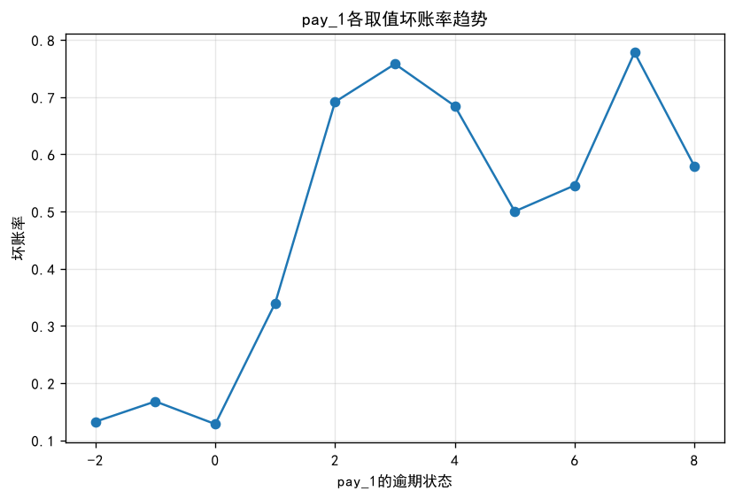

# 信用卡违约评分卡与风控策略设计

> 基于台湾信用卡违约数据集（UCI id=350，30000 条）的**全流程风控建模项目**：
> 数据清洗 → 单变量 EDA → 分箱与 WOE/IV → 共线性诊断 → 逻辑回归评分卡
> → 刻度转换与分值表 → PSI 稳定性监控 → **策略设计与损益测算** → 模型对比。
>
> **核心结论**：该资产组合的盈亏平衡坏账率为 **22.22%**，而实际坏账率为 **22.12%**，
> 安全缓冲仅 **0.10 个百分点**。基于评分卡拒绝违约概率最高的客户后，通过率
> 100% → **72.99%**，坏账率 22.12% → **12.73%**，利润率 0.09% → **6.24%**。
> 而**单条规则「最近一期有逾期」即可拿到约九成收益**（通过率 77.70%、坏账率 14.14%、利润率 5.65%）。


*本项目最重要的产出：横轴为通过率，蓝线为坏账率、橙线为净利润。
曲线的峰值出现在通过率 72.99%、利润率 6.2378%；越过峰值后继续收紧准入，
坏账率还会下降，但**利润反而减少**——因为被拒人群里已经以好客户为主了。*

---

## 目录

- [一、业务问题](#一业务问题)
- [二、数据说明](#二数据说明)
- [三、方法流程](#三方法流程)
- [四、核心结果](#四核心结果)
- [五、关键发现](#五关键发现)
- [六、局限与反思](#六局限与反思)
- [七、如何运行](#七如何运行)
- [八、项目结构](#八项目结构)
- [九、技术栈](#九技术栈)

---

## 一、业务问题

信用卡业务中，客户违约会直接造成本金损失。本项目要回答三个业务问题：

| # | 问题 | 对应代码步骤 |
|---|---|---|
| 1 | 哪些客户下个月会违约？如何量化每个客户的风险？ | 步骤 0–7（评分卡建模） |
| 2 | 模型上线后会不会失效？怎么监控？ | 步骤 8（PSI 监控） |
| 3 | **拒掉多少客户、拒掉哪些客户，才能让利润最大？** | 步骤 9（策略与损益测算） |

> 第 3 个问题是本项目的目的所在。风控的目标**不是把坏账率降到最低**，而是
> **让风险调整后的利润最大** —— 因为把客户全拒掉，坏账率就是 0，但业务也没了。

---

## 二、数据说明

| 项 | 内容 |
|---|---|
| 来源 | [UCI Machine Learning Repository, id=350](https://archive.ics.uci.edu/dataset/350/default+of+credit+card+clients)，Default of Credit Card Clients |
| 文件 | `default of credit card clients.xls`（**注意表头在第 2 行**，读取需 `header=1`） |
| 规模 | 30000 行 × 25 列，**无缺失值** |
| 时间 | 2005 年 4–9 月的账单与还款记录，标签为"下个月（10 月）是否违约" |
| 标签 | `default payment next month`，0=正常，1=违约 |
| 坏账率 | **22.12%**（6636 / 30000），多数类基线准确率 **77.88%** |

主要字段：

| 字段 | 含义 |
|---|---|
| `LIMIT_BAL` | 授信额度 |
| `SEX` / `EDUCATION` / `MARRIAGE` / `AGE` | 人口统计学特征 |
| `PAY_1` ~ `PAY_6` | 最近 6 个月逐月还款状态（−2=无消费，−1=全额还款，0=最低还款，正数=逾期月数）|
| `BILL_AMT1` ~ `BILL_AMT6` | 最近 6 个月账单金额 |
| `PAY_AMT1` ~ `PAY_AMT6` | 最近 6 个月实际还款金额 |

### 数据清洗要点

1. **未定义编码修正**
   - `EDUCATION`：数据字典只定义了 1=研究生、2=大学、3=高中、4=其他，但实际存在 **0（14 条）、5（280 条）、6（51 条）**，共 345 条 → 归入 4（其他）
   - `MARRIAGE`：存在未定义的 **0（54 条）** → 归入 3（其他）
   - 若不修正而当成数值使用，模型会认为"教育程度 6 > 教育程度 4"，但这个顺序是假的

2. **列名重命名**：`PAY_0` → `PAY_1`，使 `PAY_1~PAY_6` 符合"1=最近一期"的直觉，同时让 `range(1,7)` 循环直接可用

3. **负账单金额**：`BILL_AMT1` 有 **590 笔负值（1.97%）**，属于**溢缴款**（客户多还了钱，账单余额为负），是真实业务现象，不是错误值，需保留

4. **六个月还款额全为 0** 的客户 **1432 人（4.77%）** —— 这是业务信号（从未还款），不是缺失

---

## 三、方法流程

代码按 11 个部分组织（步骤 0–10 + 关键结果汇总），每步都有对应的 `print` 输出，可逐项核对。

| 步骤 | 内容 | 关键动作 |
|---|---|---|
| **0** | 数据加载与清洗 | 编码修正、列名重命名、缺失与异常值核查 |
| **1** | 单变量 EDA 与坏账率分析 | 各变量分组坏账率、等频分箱、**ID 时间代理检验（卡方）** |
| **2** | 分箱与单调性 | 人工粗分类、`pd.Categorical` 指定业务顺序、小样本箱合并、**空箱自检**、分箱稳定性检查 |
| **3** | WOE / IV 计算与变量筛选 | **手写 WOE 与 IV**、拉普拉斯平滑、全变量 IV 排序、导出 WOE 映射表 |
| **4** | 共线性诊断 | 相关矩阵、`\|r\|>0.7` 变量对识别、三种处理方案对比 |
| **5** | WOE 编码建模与评估 | **训练集拟合 WOE 映射后应用于测试集**（防泄漏）、基线模型、AUC/KS、5 折 CV、ROC/KS/校准曲线 |
| **6** | statsmodels 系数表与显著性 | 系数 / 标准误 / p 值 / OR / 95%CI、**VIF**、伪 R²/AIC/BIC、**剔除不显著变量的前后对比** |
| **7** | 评分卡刻度转换 | `score = A + B·ln(odds)` 推导、分值表、**方向自检断言**、分值表复核 |
| **8** | PSI 稳定性监控 | 手写 PSI、随机切分 vs **按 ID 排序的伪 OOT**、上线监控方案 |
| **9** | **策略设计与损益测算** | 盈亏平衡坏账率、通过率-坏账率-利润曲线、**硬规则策略**、**LGD 敏感性分析** |
| **10** | 模型对比与结论 | 决策树 / 随机森林 / 梯度提升 vs 评分卡 |
| **附** | 关键结果汇总 | 把所有结论集中在一个注释块里，便于逐项核对 |

### 关键方法说明

**① WOE 符号约定（全文统一）**

```
WOE = ln(坏样本占比 / 好样本占比)     → 坏账率越高的箱，WOE 越正
IV  = Σ (坏占比 − 好占比) × WOE      → 恒 ≥ 0（本质是 Jeffreys 散度）
```

这个约定下，预测"违约"(y=1) 的逻辑回归**系数应当为正**。另一套常见约定是
`WOE = ln(好/坏)`，两套的系数符号**恰好相反**。约定必须全文统一，否则系数符号解读会完全出错。

**② WOE 编码必须用训练集拟合**

`WOE 映射` 只在训练集上计算，再 `map` 到测试集，避免测试集信息泄漏到训练过程。

**③ 分箱必须指定业务顺序**

字符串分箱后 `groupby` 会按 Unicode 排序，导致"循环账户"排在"按时结清"前面，
**报表看起来单调递增，实际业务顺序是乱的**。所有有序分箱都用 `pd.Categorical(..., ordered=True)` 固定顺序。

**④ 评分卡基础分**

```
score = A − B · (β₀ + Σ βᵢ·WOEᵢ) = (A − B·β₀) − Σ B·βᵢ·WOEᵢ
       └─── 基础分 ───┘   └── 各变量分值 ──┘
```

即 **基础分 = `A − B·β₀`**，客户得分 = 基础分 − 各变量对应箱的 `bin_score` 之和。
代码里有一行复核：用分值表重构的分数与公式直接算出的分数，**最大误差 = 0.000000**。

**⑤ 损益模型**

```
盈亏平衡坏账率 = NIM / (NIM + LGD)

无策略利润率   = (1 − 坏账率) × NIM − 坏账率 × LGD
单客户利润     = (1 − p_bad) × NIM − p_bad × LGD    ← p_bad < 盈亏平衡坏账率时才该准入
```

---

## 四、核心结果

> 以下数字全部来自本脚本的实际运行输出，可用终端里的 `print` 结果逐项核对。

### 4.1 数据与清洗

| 项 | 结果 |
|---|---|
| 数据规模 | 30000 × 25，无缺失 |
| 坏账率 | **22.12%**（6636 / 30000） |
| 多数类基线准确率 | **77.88%** |
| 未定义编码 | EDUCATION 0/5/6 共 **345 条**；MARRIAGE 0 共 **54 条** |
| 六个月还款额为 0 | **1432 人（4.77%）** |
| BILL_AMT1 负值（溢缴款） | **590 笔（1.97%）** |

### 4.2 变量区分度（IV 排序）

| 变量 | IV | 处理 |
|---|---|---|
| **PAY1_bin** | **0.8610** | 保留 |
| delay_cnt_bins | 0.6695 | 排除（由 PAY_* 计算而来，信息重复） |
| PAY2_bin | 0.5445 | 保留 |
| PAY3_bin | 0.4107 | 保留 |
| PAY4_bin | 0.3585 | 保留 |
| PAY5_bin | 0.3322 | 保留 |
| PAY6_bin | 0.2883 | 保留 |
| limit_bin_final | 0.1772 | 保留 |
| pay1_bins | 0.1546 | 保留 |
| pay2_bins | 0.1393 | 保留 |
| pay_ratio1_bins | 0.1290 | 保留（见[局限 5](#5-存在一处系数符号翻转已定位未修复)） |
| pay3_bins | 0.1166 | 保留 |
| pay4_bins | 0.0821 | 保留 |
| pay6_bins | 0.0804 | 保留 |
| pay5_bins | 0.0687 | 保留 |
| util_bins | 0.0499 | 保留 |
| EDUCATION | 0.0368 | 保留 |
| age_bins | 0.0206 | 保留（见[局限 4](#4-两个变量的单调性仍未达标待优化)） |
| **BILL_AMT1~6 合计** | **0.0662**（每个均 <0.02） | **全部剔除** |
| SEX | 0.0092 | 剔除 |
| MARRIAGE | 0.0055 | 剔除 |

### 4.3 分箱后各箱坏账率（单调性已验证）

**`PAY1_bin`（最近一期还款状态）—— 单调递增：**

| 箱 | 样本数 | 坏账率 |
|---|---|---|
| 正常(≤0) | 23182 | **0.1383** |
| 逾期1个月 | 3688 | **0.3395** |
| 逾期2个月 | 2667 | **0.6914** |
| 逾期3个月以上 | 463 | **0.7192** |



*图：`PAY_1` 每个原始取值的坏账率。注意 `0 → 1 → 2` 之间存在**断崖式跃升**
（12.81% → 33.95% → 69.14%），而 `-2 / -1 / 0` 三段风险接近——
这正是把它们合并为一箱"正常(≤0)"的依据。*

**`limit_bin_final`（授信额度）—— 单调递减：**

| 箱 | 坏账率 | | 箱 | 坏账率 |
|---|---|---|---|---|
| ≤30000 | **0.3585** | | 140000~180000 | 0.1735 |
| 30000~70000 | 0.2757 | | 180000~270000 | 0.1686 |
| 70000~100000 | 0.2453 | | 270000~360000 | 0.1516 |
| 100000~140000 | 0.2285 | | >360000 | **0.1187** |

**`util_bins`（额度使用率）—— 单调递增：**

| 箱 | 样本数 | 坏账率 |
|---|---|---|
| 低使用率(≤0.2) | 13255 | 0.1830 |
| 中使用率(0.2~0.5) | 4371 | 0.2107 |
| 偏高使用率(0.5~0.8) | 4394 | 0.2633 |
| 高使用率(>0.8) | 7980 | **0.2673** |

**`pay_ratio1_bins`（还款比例）—— 单调递减：**

| 箱 | 样本数 | 坏账率 |
|---|---|---|
| 0（完全不还款） | 5553 | **0.3481** |
| (0,0.2] 少量还款 | 16183 | 0.2079 |
| (0.2,0.5] 部分还款 | 2301 | 0.1873 |
| ≥0.5 大额/全额还款（含溢缴款） | 5963 | **0.1521** |

> 说明：最初把"负数(溢缴款)"单独作为一箱时，实测它的坏账率（0.1513）
> 与"≥0.5 大额还款"（0.1521）几乎相同，却夹在"完全不还款"（0.3595）前面，
> **破坏了单调性**。因为"多还钱"并不比"按时还钱"更危险，
> 所以把两者合并为"还款充足"一箱，合并后单调性成立。

### 4.4 共线性诊断

| 项 | 结果 |
|---|---|
| `\|r\|>0.7` 变量对 | **16 组**（全部来自 BILL_AMT 之间） |
| 最严重 | `BILL_AMT1` ~ `BILL_AMT2`，**r = 0.9515** |
| `PAY_*` 之间 | 相邻月份 r = 0.77~0.82（逾期有持续性），属中等，可同时入模 |
| 按 IV 筛选后 | **最大 VIF = 3.4237**，全部 <4，**无严重共线** |

> 按 IV 剔除 BILL_AMT 后，共线性问题**自动消失** —— 变量筛选一步解决了两个问题。

### 4.5 模型表现

| 模型 | 测试 AUC | 测试 KS |
|---|---|---|
| 基线（训练集均值） | 0.5000 | 0.0123 |
| **逻辑回归评分卡** | **0.7605** | **0.3995** |
| 决策树 (max_depth=4) | 0.7399 | 0.3745 |
| 随机森林 (300 棵) | 0.7263 | 0.3615 |
| **梯度提升** | **0.7756** | **0.4148** |

| 其他指标 | 结果 |
|---|---|
| 训练集 | AUC 0.7708 / KS 0.4124 |
| AUC 差值 / KS 差值 | 0.0103 / 0.0129（**无明显过拟合**）|
| 5 折交叉验证 | AUC **0.7695 ± 0.0101** |
| 伪 R² (McFadden) | 0.1772 |
| AIC / BIC | 18295.7 / 18438.9 |

<table>
<tr>
<td></td>
<td></td>
</tr>
</table>

*图（左）ROC 曲线，AUC = 0.761；（右）KS 曲线，两条累计分布曲线的最大间距即 KS = 0.399。
风控更常用 KS，因为它对好坏样本分布的分离程度更敏感。*


*图：校准曲线。横轴是模型预测的违约概率，纵轴是实际违约率。
曲线贴近对角线说明**预测概率可信**——这是策略岗必须看校准的原因：
关卡 9 要拿概率去算期望损失，概率不准，算出来的钱就是错的。*

### 4.6 系数显著性（statsmodels）

| 项 | 结果 |
|---|---|
| 入模变量 | 17 个 |
| 正系数变量 | **16 个** |
| 负系数变量 | **1 个**：`pay_ratio1_bins` = **−0.2024**（p=0.0150）|
| **不显著变量（p>0.05）** | **6 个** |

**不显著变量明细：**

| 变量 | 系数 | p 值 |
|---|---|---|
| `pay5_bins` | +0.0026 | **0.9784** |
| `PAY2_bin` | +0.0417 | **0.3013** |
| `age_bins` | +0.2309 | 0.0975 |
| `pay4_bins` | +0.1594 | 0.0928 |
| `PAY4_bin` | +0.0960 | 0.0706 |
| `pay6_bins` | +0.1698 | 0.0523 |

**剔除不显著变量前后对比：**

| 特征集 | 测试 AUC | 测试 KS |
|---|---|---|
| 全变量（17 个） | 0.7605 | 0.3995 |
| 仅显著（11 个） | 0.7592 | 0.3972 |
| **差值** | **−0.0013** | **−0.0023** |

> 6 个不显著变量只贡献了 **0.0013 的 AUC**，却带来 6 个无法向业务解释的系数
> —— **结论：应该剔除**。这也验证了"IV 海选、回归终选"的变量筛选逻辑。

### 4.7 评分卡

| 参数 | 值 |
|---|---|
| base_score / base_odds / PDO | 600 / 20 / 50 |
| B = PDO / ln2 | **72.1348** |
| A = base_score − B·ln(base_odds) | **383.9036** |
| **基础分 = A − B·β₀** | **473.89** |
| 分数范围（训练集） | 202.38 ~ 615.65，中位 509.77 |
| 分数范围（测试集） | 204.39 ~ 605.57，中位 509.64 |
| **分值表复核误差** | **0.000000** |


*图：训练集与测试集的分数分布几乎完全重合（中位数 509.77 vs 509.64），
说明模型在两组样本上表现一致，没有出现分布偏移。*

**部分分值表（`outputs/score_card.csv` 为完整版）：**

| 变量 | 分箱区间 | WOE | β 系数 | bin_score |
|---|---|---|---|---|
| PAY1_bin | 正常(≤0) | −0.5819 | 0.7474 | −31.37 |
| PAY1_bin | 逾期1个月 | +0.6048 | 0.7474 | +32.61 |
| PAY1_bin | 逾期2个月 | +2.0796 | 0.7474 | **+112.12** |
| PAY1_bin | 逾期3个月以上 | +2.1835 | 0.7474 | **+117.72** |
| EDUCATION | 4（其他） | −1.2645 | 0.3426 | −31.25 |
| limit_bin_final | ≤30000 | +0.7217 | 0.1897 | +9.88 |
| limit_bin_final | >360000 | −0.7733 | 0.1897 | −10.58 |

> 用法：**客户得分 = 473.89 − Σ bin_score**。
> 例如某客户各箱 `bin_score` 之和为 −58.45 分，则其得分为 473.89 + 58.45 = **532.34** 分
> （代码最后有一行单个客户的实测验算）。

### 4.8 PSI 稳定性

| 场景 | 最大 PSI | 判定 |
|---|---|---|
| 训练集 vs 随机切分测试集 | **0.001142** | 数学必然≈0，**不构成稳定性证据** |
| **按 ID 排序的伪 OOT** | **0.06948**（pay3_bins）| 稳定（其余全部 <0.015）|

| 伪 OOT 对比 | 坏账率 |
|---|---|
| 前 70%（早期样本） | **22.84%** |
| 后 30%（后期样本） | **20.44%** |

### 4.9 策略与损益测算

**参数假设**：NIM（净息差率）= **20%**，LGD（违约损失率）= **70%**
 本数据集没有资金成本与催收回收数据，**这两个参数是假设值，不是实测值**。

```
盈亏平衡坏账率 = NIM / (NIM + LGD) = 0.20 / 0.90 = 22.22%
实际整体坏账率 = 22.12%
安全缓冲 = 0.10 个百分点   ← 极度脆弱
```

**通过率 — 坏账率 — 利润曲线（测试集 9000 条）：**

| cutoff | 通过率 | 坏账率 | 利润率 |
|---|---|---|---|
| 0（无策略，全通过）| 100.00% | 0.2212 | **0.0900%** |
| 0.0828 | 11.58% | 0.0749 | 1.54% |
| 0.1241 | 36.74% | 0.0844 | 4.56% |
| 0.1655 | 59.99% | 0.1139 | 5.85% |
| **0.2069（最优）** | **72.99%** | **0.1273** | **6.2378%** |
| 0.2483 | 76.63% | 0.1332 | 6.14% |
| 0.3517 | 83.48% | 0.1500 | 5.43% |
| 0.6000 | 91.49% | 0.1777 | 3.67% |

> 曲线在峰值附近很平坦：通过率从 72.99% 放宽到 91.49%，利润率只从 6.24% 降到 3.67%
> —— 业务上可以在通过率和利润率之间做取舍，不必死守数学最优点。

**硬规则策略（测试集）：**

| 规则 | 命中率 | 命中坏账率 | 拒绝后通过率 | 拒绝后坏账率 | 拒绝后利润率 |
|---|---|---|---|---|---|
| **规则1：最近一期有逾期** | 22.30% | **49.93%** | **77.70%** | **14.14%** | **5.65%** |
| 规则2：最近一期逾期2个月 | 8.67% | **68.33%** | 91.33% | 17.74% | 3.69% |
| 规则3：额度使用率>0.8 | 26.83% | 26.21% | 73.17% | 20.62% | 1.05% |
| 规则4：有逾期 且 使用率>0.8 | 7.50% | 52.59% | 92.50% | 19.65% | 2.14% |
| 规则5：授信额度≤3万 | 13.52% | 33.36% | 86.48% | 20.36% | 1.45% |

**LGD 敏感性分析：**

| LGD | 盈亏平衡坏账率 | 最优 cutoff |
|---|---|---|
| 0.50 | 28.57% | 0.269 |
| 0.60 | 25.00% | 0.207 |
| **0.70** | **22.22%** | **0.207** |
| 0.80 | **20.00%** | 0.207 |

> **LGD 升到 0.80 时，盈亏平衡坏账率降到 20.00%，低于实际坏账率 22.12% ——
> 该资产组合将转为亏损。** 这说明结论对 LGD 假设高度敏感。

---

## 五、关键发现

### ① 该资产组合处在盈亏平衡线附近，风控是"生死开关"而非"优化项"

盈亏平衡坏账率 **22.22%** vs 实际 **22.12%**，缓冲只有 **0.10 个百分点**。
在这个位置，坏账率的微小变化就是盈利与亏损的区别 —— 这也解释了为什么在
NIM=20%、LGD=70% 的参数下，把坏账率从 22.12% 压到 12.73%，
利润率能从 **0.0900% 跳到 6.2378%（约 69 倍）**。

> 注意：这个"69 倍"是**盈亏平衡点附近的数学放大效应**（利润 = 两个大数相减的小差），
> 不是业务凭空多赚了 69 倍。绝对值完全依赖 NIM/LGD 假设。

### ② 单条规则就能拿到评分卡约九成的收益

| 策略 | 通过率 | 坏账率 | 利润率 |
|---|---|---|---|
| 评分卡最优（cutoff=0.207） | 72.99% | 12.73% | **6.24%** |
| **单条规则：最近一期有逾期** | **77.70%** | 14.14% | **5.65%** |

单条规则的通过率更高，利润率只低 0.59 个百分点。原因是本数据存在一个"超级变量"
（`PAY1_bin` 的 IV = 0.8610），9 个变量的评分卡收益主要来自它。

**这解释了风控策略岗的真实工作状态**：真实业务中大量策略是"简单规则 + 名单"，
因为规则**可解释、可审计、上线快、出事好定位**；评分卡更适合缺少单一强变量、
需要精细排序或定额度的场景。行业常规是**组合方案：硬规则前置拦截极端风险，评分卡做主准入**。

### ③ "欠多少钱"几乎没有预测力，"还得怎么样"才是关键

`BILL_AMT1~BILL_AMT6` 六个账单金额变量的 **IV 合计只有 0.0662**，每一个都 <0.02（无用）。
而还款状态（`PAY_*`）和还款金额（`PAY_AMT*`）的 IV 高达 0.07~0.86。

**业务解释**：账单金额高低主要反映消费能力/授信额度水平，不反映还款意愿。
一个额度 30 万、欠 20 万但每月按时还款的客户，风险远低于额度 1 万、欠 5000 但逾期的客户。

### ④ 单变量 IV 高 ≠ 多变量有用

`PAY2_bin` 的单变量 IV = **0.5445**（全变量第 3 高），但进入多变量逻辑回归后
**p = 0.3013，完全不显著**。

**原因**：它与 `PAY1_bin` 相关系数 r = 0.672，"最近一期还款状态"已经吸收了它的大部分信息。

> **IV 负责"海选"，逻辑回归负责"终选"。IV 高只是入场券，不代表能留在模型里。**

### ⑤ 共线性会让系数"显著但符号错误"——本项目实测到了一例

`pay_ratio1_bins` 的系数是 **−0.2024，p = 0.0150（统计上显著）**，但符号与业务逻辑相反：
还款比例越高应当风险越低，系数却为负。

**成因**：它的分子 `PAY_AMT1` 与 `pay1_bins` 重复，分母 `BILL_AMT1` 已通过 `util_bins` 入模
—— 三个变量都在描述"还款能力"，信息重叠导致系数被扭曲。

> 这正是本项目在共线性诊断一节里写的**"共线性下系数符号颠倒，评审无法解释"**
> —— 文档里的理论，在自己的模型里被实测复现了。
> **处理建议：`pay1_bins` 与 `pay_ratio1_bins` 只保留一个（推荐保留单调且显著的 `pay1_bins`）。**

### ⑥ 时间稳定性无法验证，且随机切分的 PSI 是个陷阱

数据集**没有日期字段**，仅有 1~30000 的顺序 ID。卡方检验显示 ID 分段间坏账率
**p<0.001 显著**，但各段极差只有 **0.0395** 且无单调趋势 —— 判定为
**大样本下的统计显著，而非真实时间漂移**，因此不采用 ID 作为时间代理。

- **随机切分的 PSI ≈ 0.001** 是数学必然（同一总体随机抽样，分布本来就该一样），
  **不能当作稳定性证据**
- 只有**按 ID 排序的伪 OOT**（最大 PSI = 0.06948）才有一点参考价值，它揭示
  早期样本坏账率 22.84% 高于后期 20.44%

---

## 六、局限与反思

### 1. 无法进行真正的时间外（OOT）验证 
数据无日期字段。所有验证都是**分层随机切分**，因此模型的**时间稳定性未经验证**。
真实业务中客群结构、宏观环境、竞品策略都会随时间变化，模型可能在 6~12 个月后失效。
**本项目的 KS=0.3995 不能保证在未来样本上成立。**

### 2. 样本选择偏差（reject inference）
本数据全部是**已发卡客户**（即已经通过了当年审批的样本），**不含拒绝样本**。
而策略上线时面对的是**全部申请者**。
**因此本项目的策略效果不能直接外推到全量申请人群。**

### 3. 损益测算依赖假设参数
`NIM=20%`、`LGD=70%` 均为**假设值**，数据集中没有资金成本、催收回收数据。
实测 LGD 升到 0.80 时，盈亏平衡坏账率（20.00%）就低于实际坏账率（22.12%），
资产组合转为亏损 —— **结论对该假设高度敏感**。

### 4. 两个变量的单调性仍未达标（待优化）
- **`age_bins`**：原始 10 箱等频分箱，WOE 呈锯齿状（U 型 + 噪声），
  且 p=0.0975 不显著、IV=0.0206 刚刚压线。**三条都不合格，本应优先剔除。**
- **`EDUCATION=4`**：只有 468 人，坏账率仅 7.05%（其他档 19%~25%），
  WOE = −1.26 严重破坏单调性，很可能是特殊客群（如学生卡、VIP 卡）混入。
  **建议做粗分类或直接剔除。**

### 5. 存在一处系数符号翻转（已定位，未修复）
`pay_ratio1_bins` 是唯一的负系数（−0.2024，p=0.0150），成因是与
`pay1_bins`/`util_bins` 的信息重叠。**建议二者只保留一个。**
本项目保留了完整变量集以展示问题，实际交付时应剔除。

### 6. 如果给我真实数据，我会这样做
1. 按**放款月份**切分做真正的 OOT（训练早期、验证后期）
2. 按**月**计算分数 PSI 做漂移监控，设置 0.1/0.25 双阈值告警
3. 用**冠军挑战者**框架小流量验证策略，观察 1~2 个账期
4. 补充**拒绝推断**或在小流量上做 A/B 实验，校正样本选择偏差
5. 用真实催收数据估计 LGD，替换假设值

---

## 七、如何运行

### 环境依赖

```bash
pip install -r requirements.txt
```

> 或手动安装：
> ```bash
> pip install pandas numpy matplotlib statsmodels scikit-learn scipy openpyxl xlrd
> ```
> Python 3.13 / pandas 3.0.3 / numpy 2.5.1 / scikit-learn 1.9.0 / statsmodels 0.14.6 下测试通过。
> 读取 `.xls` 需要 `xlrd`。

### 数据准备

从 [UCI 数据集页面](https://archive.ics.uci.edu/dataset/350/default+of+credit+card+clients)
下载 `default of credit card clients.xls`。

**脚本会按以下顺序自动查找数据文件**（用第一个存在的）：

| 顺序 | 位置 | 说明 |
|---|---|---|
| ① | 脚本同级目录 | **推荐**：把 `.xls` 和 `credit-scorecard.py` 放在一起即可 |
| ② | 脚本同级 `data/` 子目录 | 想把数据单独放一个文件夹时用 |
| ③ | `CANDIDATE_PATHS` 里的其他路径 | 数据放在别处时，把路径加进这个列表 |

所以正常情况下**不需要改任何代码**——把 `.xls` 放到脚本旁边就能跑。
如果三个位置都找不到，脚本会抛出明确的提示：

```
FileNotFoundError: 找不到数据文件：default of credit card clients.xls
请从 https://archive.ics.uci.edu/dataset/350 下载 "default of credit card clients.xls"，
放到脚本同级目录（或 data/ 子目录）即可；
也可以修改脚本顶部的 CANDIDATE_PATHS 指向你的实际路径。
```

> 该文件**前两行都是表头**（第一行是 X1..X23，第二行才是真实列名），
> 所以读取必须用 `pd.read_excel(path, header=1)`。
> 数据集本身**未包含在仓库中**（`.gitignore` 已忽略 `*.xls`），需自行下载。

### 运行

```bash
python credit-scorecard.py
```

脚本会自动在**脚本所在目录**创建 `outputs/` 文件夹，把 6 张图和 5 个结果表落盘到这里。

> 若想把终端输出也保存下来（便于核对本 README 的数字）：
> ```powershell
> $env:PYTHONIOENCODING='utf-8'; python credit-scorecard.py *> run_output.txt
> ```

### 输出文件

| 文件 | 内容 |
|---|---|
| `01_pay1_badrate_trend.png` | `PAY_1` 各取值坏账率趋势 |
| `02_roc_curve.png` | ROC 曲线 |
| `03_ks_curve.png` | KS 曲线（两条累计分布 + 最大间距）|
| `04_calibration_curve.png` | 校准曲线 |
| `05_score_distribution.png` | 训练/测试集分数分布对比 |
| `06_passrate_badrate_profit.png` | **通过率-坏账率-利润曲线** |
| `woe映射表.csv` | 全变量 WOE 映射表（生产环境部署用）|
| `score_card.csv` | **评分卡分值表**（业务方手工算分用）|
| `rule_strategy.csv` | 硬规则策略测算结果 |
| `lgd_sensitivity.csv` | LGD 敏感性分析 |
| `model_compare.csv` | 模型对比结果 |

> 注：具体数值会因 `random_state`、库版本、分箱实现细节略有差异，
> **结论和量级一致即可**，不必强求完全相同的数字。

---

## 八、项目结构

```
风控项目/
├── .gitignore                 # 忽略虚拟环境、缓存、原始数据文件
├── requirements.txt           # Python 依赖
├── credit-scorecard.py        # 主脚本（步骤 0–10 + 关键结果汇总）
├── README.md                  # 本文件
└── outputs/                   # 运行后自动生成
    ├── 01_pay1_badrate_trend.png
    ├── 02_roc_curve.png
    ├── 03_ks_curve.png
    ├── 04_calibration_curve.png
    ├── 05_score_distribution.png
    ├── 06_passrate_badrate_profit.png
    ├── woe映射表.csv
    ├── score_card.csv
    ├── rule_strategy.csv
    ├── lgd_sensitivity.csv
    └── model_compare.csv
```

**脚本步骤索引**（便于定位代码）：

| 行号 | 步骤 |
|---|---|
| 1–34 | 导入与全局配置（中文字体、数据路径、输出目录）|
| 36–45 | 数据文件查找与报错提示 |
| 53 | `步骤0` 数据加载与清洗 |
| 84 | `步骤1` 单变量 EDA 与坏账率分析 |
| 163 | `步骤2` 分箱与单调性 |
| 285 | `步骤3` WOE / IV 计算与变量筛选 |
| 351 | `步骤4` 共线性诊断 |
| 394 | `步骤5` WOE 编码建模与评估 |
| 508 | `步骤6` statsmodels 系数表与显著性 |
| 577 | `步骤7` 评分卡刻度转换 |
| 661 | `步骤8` PSI 稳定性监控 |
| 744 | `步骤9` **策略设计与损益测算** |
| 918 | `步骤10` 模型对比与结论 |
| 948 | **关键结果汇总**（所有结论集中在一个注释块里，便于核对）|

---

## 九、技术栈

| 类别 | 工具 |
|---|---|
| 数据处理 | pandas、numpy |
| 统计推断 | scipy（卡方检验）、statsmodels（Logit、VIF、OR、置信区间）|
| 机器学习 | scikit-learn（逻辑回归、决策树、随机森林、梯度提升、交叉验证、校准曲线）|
| 可视化 | matplotlib |
| 核心方法 | 卡方/等频分箱、WOE、IV、逻辑回归、评分卡刻度转换、KS、AUC、PSI、通过率-坏账率-利润曲线、盈亏平衡坏账率 |

---

## 附：可复用的核心公式

```python
# WOE 与 IV（本项目约定：WOE = ln(坏/好)）
WOE_i = ln( bad_pct_i / good_pct_i )
IV    = Σ ( bad_pct_i − good_pct_i ) × WOE_i        # 恒 ≥ 0

# KS
KS = max | 累计坏样本占比 − 累计好样本占比 |

# PSI
PSI = Σ ( actual_pct_i − base_pct_i ) × ln( actual_pct_i / base_pct_i )

# 评分卡刻度
B = PDO / ln(2)
A = base_score − B × ln(base_odds)
score = A + B × ln(odds)          # odds = 好/坏，分数越高越安全
base_point = A − B × β₀           # 基础分
客户得分 = base_point − Σ ( B × βᵢ × WOEᵢ )

# 损益
盈亏平衡坏账率 = NIM / (NIM + LGD)
无策略利润率   = (1 − 坏账率) × NIM − 坏账率 × LGD
```
